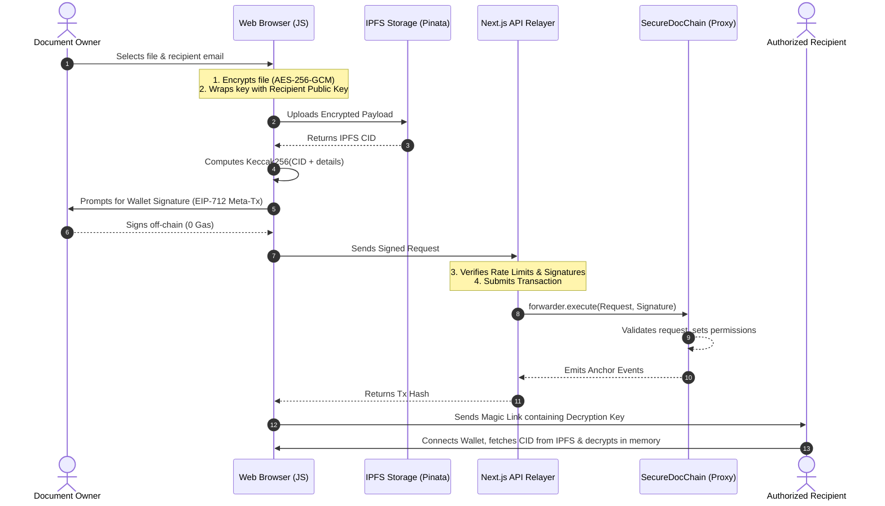

# 🔐 SecureDocChain
### Production-Grade Decentralized Document Custody, Verification & Gasless Sharing Platform

[](https://opensource.org/licenses/MIT)
[](https://soliditylang.org/)
[](https://nextjs.org/)
[](https://amoy.polygonscan.com)

SecureDocChain is an enterprise-ready decentralized custody, distribution, and signing platform. It guarantees absolute privacy and non-repudiation by combining client-side Web Crypto symmetric encryption (**AES-256-GCM**) with decentralized storage (**IPFS**) and immutable on-chain anchoring via upgradeable smart contracts (**UUPS Proxy**) on the Polygon network. 

---

## 📖 Table of Contents
- [🌟 Product Overview](#-product-overview)
  - [The Problem](#the-problem)
  - [The SecureDocChain Solution](#the-securedocchain-solution)
- [🏗️ Architectural Topology](#️-architectural-topology)
  - [Cryptographic Workflow](#cryptographic-workflow)
- [🛡️ Security & Sandbox Systems](#️-security--sandbox-systems)
  - [Visual & Local Leakage Safeguards](#visual--local-leakage-safeguards)
  - [High-Security Canvas PDF Viewer](#high-security-canvas-pdf-viewer)
- [📜 Smart Contract Specification](#-smart-contract-specification)
  - [UUPS Upgradeable & Storage Safety](#uups-upgradeable--storage-safety)
  - [On-Chain Signatures & Approvals](#on-chain-signatures--approvals)
  - [Batch Access Control](#batch-access-control)
  - [ERC-2771 Gasless Meta-Transactions](#erc-2771-gasless-meta-transactions)
- [⚙️ Project Structure](#️-project-structure)
- [🚀 Quickstart & Installation](#-quickstart--installation)
  - [1. Smart Contract Suite](#1-smart-contract-suite)
  - [2. Frontend Web Application](#2-frontend-web-application)
- [🔧 Troubleshooting & FAQ](#-troubleshooting--faq)
- [👥 Authors & Credits](#-authors--credits)

---

## 🌟 Product Overview

### The Problem
Traditional document-sharing platforms (like Google Drive, DocuSign, or Dropbox) operate on a **custodial model**. You upload your raw, unencrypted files directly to their servers. This introduces critical vulnerabilities:
1. **Centralized Data Breaches:** If the platform's servers are compromised, your sensitive documents, agreements, or intellectual property are leaked.
2. **Lack of True Ownership:** Centralized providers can access, index, modify, or restrict access to your documents at will.
3. **High Onboarding Friction (Web3):** Traditional blockchain networks require all participating users to acquire, fund, and manage cryptocurrency wallets (gas fees) just to sign or view documents.

### The SecureDocChain Solution
SecureDocChain introduces a **Zero-Knowledge decentralized sharing system**:
- **Zero-Knowledge Security:** Documents are encrypted *locally inside the user's browser* before being sent to IPFS. The encryption keys never touch a server database.
- **On-chain State Anchoring:** The cryptographic proof (document hash), owner details, and permission logs are immutably written to the Polygon blockchain.
- **On-Chain Signatures**: Document approvals/signatures are anchored directly to the Polygon blockchain (level-3 sign access required), generating cryptographically verifiable records.
- **Zero Gas Cost (Gasless Relayer):** Users sign transaction intents off-chain with their wallet. A secure backend Relayer submits them to the network, sponsoring the gas fees. Users interact with the blockchain for **free**.

---

## 🏗️ Architectural Topology

### Cryptographic Workflow
Every document uploaded to SecureDocChain follows a decentralized cryptographic lifecycle:

1. **Client-Side Encryption:** The owner selects a document. The browser generates a cryptographically secure 256-bit symmetric key and encrypts the file using `AES-256-GCM` with a unique initialization vector (`IV`).
2. **Symmetric Key Wrapping:** The symmetric key is encrypted using the recipient's public key (Asymmetric Encryption), generating a unique **Share Token**.
3. **Decentralized Storage:** The encrypted file blob is uploaded directly to IPFS (via a Pinata proxy). IPFS returns a unique Content Identifier (`CID`).
4. **On-Chain Anchoring:** The frontend builds a `docHash` (Keccak256 hash of document properties) and submits it to the blockchain alongside the `CID`.



---

## 🛡️ Security & Sandbox Systems

To prevent visual piracy (taking photos of screens), clipboard leaks, and side-channel developer tools inspections, the sharing viewport enforces a **Restricted View Sandbox Window** using React Portals.

### Visual & Local Leakage Safeguards

| Safeguard | Operational Mechanism | Purpose |
| :--- | :--- | :--- |
| **Forensic Watermark** | Synthesizes a parallel diagonal SVG watermark grid (`-20deg` rotation) containing the viewer's email, wallet address, current timestamp, and document hash. | Defeats phone camera photography and screen recordings. |
| **Dynamic Hover Blurring** | Content remains blurred (`blur(30px)`) until the user's cursor actively hovers inside the document viewing viewport. | Mitigates visual shoulder-surfing and automated screen-capture utilities. |
| **Focus-Loss Lockout** | Triggers an immediate blur lock if the browser window loses focus. The system automatically detects focus transitions to the preview viewer and keeps it unblurred for scrolling. | Prevents system capture grabbing tools from getting a clear frame. |
| **Focus-Recovery Lock** | Refocusing does not auto-unblur content. The user must manually click an interactive modal to acknowledge the refocus event. | Prevents quick-capture screenshot scripting loops. |
| **OS Shortcut Blocking** | Intercepts keyboard events for PrintScreen, Snipping tool (`Win+Shift+S`), and macOS snapshot hotkeys (`Cmd+Shift+3/4/5`). | Inhibits default OS screen grabbing shortcuts. |
| **Developer Tools Blocker** | Blocks shortkeys for inspect element (`F12`, `Ctrl+Shift+I`, `Cmd+Option+I`, etc.) and cancels right-click contexts. | Prevents extracting raw images/text from the browser DOM. |
| **Escape Key Dismissal** | Pressing the `Esc` button on the keyboard instantly closes the preview overlay window or modals. | Delivers a clean, desktop-like user experience. |

### High-Security Canvas PDF Viewer
To block raw PDF file downloads and text selection copy-pasting, SecureDocChain replaces default browser `<iframe>` previewers with a custom **HTML5 Canvas PDF Viewer**:
* **Raster Rendering**: Renders pages to canvas layers at a high-density `2.0x` device pixel density, keeping the output extremely crisp.
* **Selection & Copy Blocked**: Disables all text selection, drag-and-drop, and right-click download options on pages.
* **Interactive Zoom controls**: Floating toolbar with Zoom In (`+`), Zoom Out (`-`), and Reset buttons to scale pages dynamically.

---

## 📜 Smart Contract Specification

The smart contracts suite is structured using the UUPS Proxy upgradeable pattern and is compiled using Solidity `0.8.24` targeting EVM `cancun`.

### UUPS Upgradeable & Storage Safety
Unlike standard contracts, upgradeable proxies must protect their storage slot variables to prevent variables from shifting during implementation updates:
- **`SecureDocStorage.sol`**: An abstract storage contract containing all structural state definitions. In subsequent upgrades, new variables must be appended *before* the `__gap` array, and the gap size must be reduced by the exact number of slots added.
- **`SecureDocChain.sol`**: The logic implementation contract. It contains zero state variable declarations and can be fully upgraded by calling `upgradeToAndCall()`.

```
Proxy Contract (0xb1a3A3...)  ──>  Delegates Calls  ──>  Implementation Logic (0xf0B031...)
    (Holds all state variables & MATIC balances)               (Holds code execution rules)
```

### On-Chain Signatures & Approvals
Document approvals (access level 3) write transactions on-chain directly via `signDocument(bytes32 _docHash)`. Double-signing is prevented at the contract level. Collaborators can approve documents, and their signatures are automatically fetched and verified directly from the Polygon blockchain.

### Batch Access Control
To minimize transaction fees and user actions, the contract implements `batchGrantAccess(bytes32 _docHash, address[] _users, uint8[] _levels)`. This allows granting tiered access (View, Edit, Sign) to multiple addresses in a single sponsored paymaster transaction.

### ERC-2771 Gasless Meta-Transactions
- **`SecureDocForwarder.sol`**: Receives requests signed off-chain, validates the EIP-712 cryptographic signature, and executes them on the registry.
- **`_msgSender()` Override**: In `SecureDocChain.sol`, `msg.sender` is replaced by `_msgSender()`. When executed via the trusted forwarder, the contract extracts the original user's address from the end of the calldata payload, ensuring standard access checks behave correctly.

---

## ⚙️ Project Structure

```
SecureDocumentSharing/
├── contracts/                    # Smart contract hardhat workspace
│   ├── contracts/
│   │   ├── SecureDocStorage.sol  # Base storage layout contract
│   │   ├── SecureDocChain.sol    # Registry implementation logic
│   │   └── SecureDocForwarder.sol# ERC-2771 gasless forwarder
│   ├── scripts/
│   │   ├── deploy.ts             # Deployer script for forwarder and proxy
│   │   ├── upgrade.ts            # Script for upgrading logic implementation
│   │   └── sync-abi.js           # Syncs compiled ABIs to frontend configuration
│   ├── test/
│   │   └── SecureDocChain.test.ts# Complete Mocha/Chai test suite
│   └── hardhat.config.ts         # Hardhat configs with solc 0.8.24 options
│
├── frontend/                     # Next.js frontend web app
│   ├── src/
│   │   ├── app/
│   │   │   ├── api/
│   │   │   │   ├── relayer/      # Server-side meta-transaction gas relayer
│   │   │   │   ├── share/        # NodeMailer/Brevo transactional share route
│   │   │   │   └── sync-notify/  # SMTP owner synchronization link notifier
│   │   │   ├── share/[token]/     # Secure view sandbox portal
│   │   │   └── share/sync/       # Decentralized browser-sync portal
│   │   ├── lib/
│   │   │   ├── web3.ts           # Ethers.js integration with FallbackProvider
│   │   │   ├── comments.ts       # P2P comments merge logic helper
│   │   │   ├── store.ts          # LocalStorage client database wrapper
│   │   │   └── contract.ts       # Synced ABI registry
│   └── .env.local                 # Relayer key & email client API keys
```

---

## 🚀 Quickstart & Installation

### 1. Smart Contract Suite
Navigate to the contracts directory and install dependencies:
```bash
cd contracts
npm install --legacy-peer-deps
```

**Run local unit tests:**
Ensure the entire upgrade, batch, signature, and meta-transaction suite passes:
```bash
npx hardhat test
```

**Deploy to Polygon Amoy:**
Create `contracts/.env` and define your variables:
```env
PRIVATE_KEY=your_funded_wallet_private_key
AMOY_RPC_URL=https://polygon-amoy.drpc.org
```
Execute the deploy script:
```bash
npx hardhat run scripts/deploy.ts --network amoy
```
Make note of the printed **Forwarder** and **Proxy** addresses.

---

### 2. Frontend Web Application
Navigate to the frontend directory and install dependencies:
```bash
cd ../frontend
npm install
```

**Configure Local Environment (`frontend/.env.local`):**
Create the file and configure active variables:
```env
# ── IPFS Settings
NEXT_PUBLIC_PINATA_JWT=your_pinata_jwt_token
NEXT_PUBLIC_GATEWAY_URL=https://gateway.pinata.cloud/ipfs

# ── Deployed Smart Contract Addresses
NEXT_PUBLIC_CONTRACT_ADDRESS=your_deployed_proxy_address
NEXT_PUBLIC_FORWARDER_ADDRESS=your_deployed_forwarder_address

# ── Relayer Paymaster Wallet Key (pays gas for users)
RELAYER_PRIVATE_KEY=your_funded_private_key

# ── Reown / WalletConnect ID
NEXT_PUBLIC_REOWN_PROJECT_ID=your_reown_project_id

# ── Email Delivery (MailerSend / Brevo)
MAILERSEND_API_KEY=your_mailersend_api_key
MAILERSEND_FROM_EMAIL=noreply@yourdomain.com
BREVO_API_KEY=your_brevo_api_key
BREVO_FROM_EMAIL=your_email@gmail.com
BREVO_FROM_NAME=SecureDocChain

# ── Gmail SMTP Fallback
GMAIL_USER=your_email@gmail.com
GMAIL_APP_PASSWORD=your_gmail_app_password
```

**Run the development server:**
```bash
npm run dev
```
Open [http://localhost:3000](http://localhost:3000) in your browser.

---

## 🔧 Troubleshooting & FAQ

#### Q: How does the FallbackProvider work?
A: In `frontend/src/lib/web3.ts`, instead of querying a single public RPC node (which can return `429 Too Many Requests`), we bundle three distinct RPC URLs inside an ethers `FallbackProvider`. If one endpoint is rate-limited, requests failover to the next node instantly.

#### Q: How do I upgrade the contract implementation?
A: 1. Deploy the new contract implementation version.
2. Set the `PROXY_ADDRESS` env variable.
3. Run:
   ```bash
   PROXY_ADDRESS=0x... npx hardhat run scripts/upgrade.ts --network amoy
   ```

#### Q: The relayer returns "on-chain verification failed"?
A: Ensure the user's wallet address has signed the correct parameters. The forwarder tracks nonces internally (`forwarder.nonces(user)`); if the nonce mismatch occurs (e.g. from executing an out-of-order meta-transaction), verification fails.

---

## 👥 Authors & Credits
Designed and engineered for secure sharing by:
- **Samir Jumade**
- **Karan Bharda**

---
*Distributed under the MIT License. Reference [LICENSE](LICENSE) for terms.*
