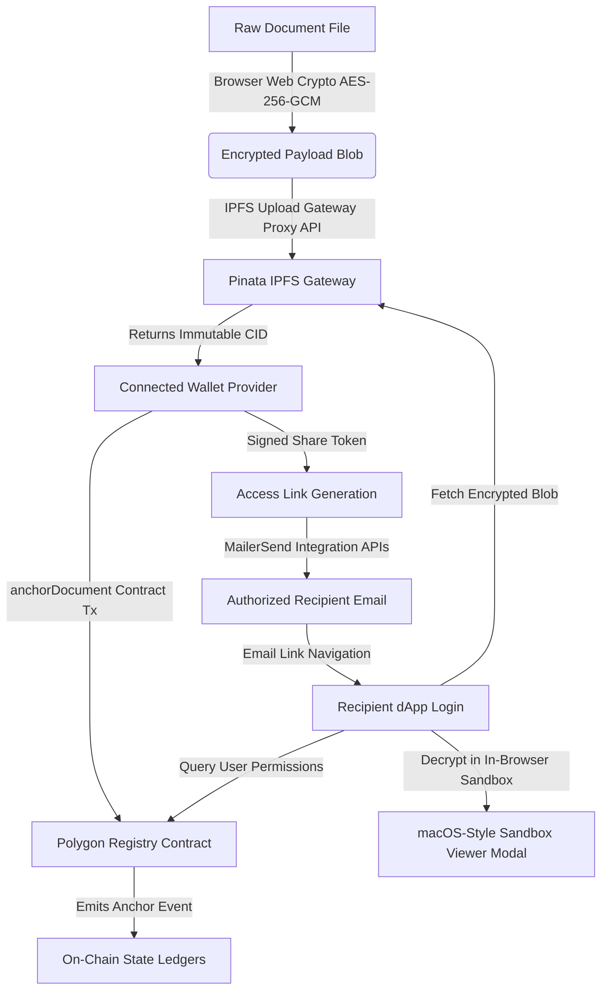

# 🔐 SecureDocChain: Production-Grade Decentralized Document Custody & Sharing Platform

Welcome to the official developer guide and documentation manual for **SecureDocChain** — an enterprise-grade decentralized document registry, distribution, and signing platform. SecureDocChain combines client-side Web Crypto symmetric encryption (AES-256-GCM) with IPFS storage (Pinata Gateway) and immutable, on-chain state anchoring on the **Polygon Amoy Testnet** to guarantee absolute document confidentiality, non-repudiation, and fine-grained access control.

---

## 🏗️ Architectural Topology

SecureDocChain enforces a zero-knowledge trust model. The server hosting the application never receives or stores raw documents, private cryptographic keys, or decryption passphrases. 

### Core Cryptographic Lifecycle Flow



---

## 🔒 Multi-Layered Sandbox Security Systems

To protect document contents from visual leakage, local interception, and side-channel attacks, the document viewer incorporates a **Restricted View Sandbox Window** implemented at the root level via React Portals. This system blocks both digital and analog screenshots and restricts normal browser capabilities.

### 🛡️ Active Safeguards

| Safeguard | Mechanism | Purpose |
| :--- | :--- | :--- |
| **Dual-Angle Repeating Watermark** | Synthesizes an SVG grid containing the viewer's wallet address, mapped email identity, current timestamp, active share token, and document hash. Stamped diagonally at `-25deg` and `+25deg`. | Defeats physical camera photography leakage and analog captures. |
| **Dynamic Cursor Hover Blurring** | Wraps the document viewport. Content remains heavily blurred (`blur(30px)`) until the user places the cursor directly inside the document viewport. | Mitigates visual eavesdropping and automated background screen capture scripts. |
| **Focus-Loss Lockout** | Listens for the browser `blur` event. If the window loses focus (e.g. user triggers a system screenshot utility, switches tabs, or opens a side tool), the content locks into blur mode permanently. | Blocks active screenshot grabbers from capturing content on frame change. |
| **Focus-Loss Recovery Lock** | The viewer does not auto-unblur upon window refocus. The user must manually click an interactive warning dialog to acknowledge the focus event and resume viewing. | Mitigates quick-capture screenshot loops. |
| **Hardware Key & Shortcut Interceptor** | Captures keyboard events globally. Intercepts `PrintScreen` commands, macOS screenshot triggers (`Cmd+Shift+3/4/5`), and Windows Snipping Tool triggers (`Win+Shift+S`). | Disables standard operating system screenshot utilities. |
| **Inspector and DevTools Blocker** | Detects and cancels developer tools key shortcuts (`F12`, `Ctrl+Shift+I`, `Ctrl+Shift+C`, `Ctrl+Shift+J`, `Cmd+Option+I`). | Prevents users from inspecting source text or extracting underlying media assets. |
| **DOM Command Restraints** | Cancels copy-paste actions (`onCopy`, `onCut`, `onPaste`, `onDragStart`), printing commands (`Ctrl+P`, `Cmd+P`), and right-click menus (`onContextMenu`). | Enforces strict view-only reading capabilities. |

---

## 📜 Smart Contract Specification: `SecureDocChain.sol`

The platform uses a Solidity smart contract deployed to the **Polygon Amoy Testnet** to govern ownership registry, permission records, version control, access logs, and emergency pauses.

### Structural Data Schemes

```solidity
struct AccessRecord {
    uint8 level;          // 0 = Revoked/None, 1 = View Only, 2 = Edit, 3 = Edit & Sign
    uint256 keyVersion;   // Incrementing counter to force invalidation of legacy keys
    uint256 grantedAt;    // Block timestamp of authorization
}

struct Document {
    string fileName;
    string cid;
    string docType;
    uint256 expiry;
    bool ipTimestamp;
    address owner;
    uint256 keyVersion;   // Increments upon revocation to rotate shared keys
}
```

### Main Operational Interface

1. **`createDocument(bytes32 docHash, string memory fileName, string memory cid, string memory docType, uint256 expiry, bool ipTimestamp)`**
   - Anchors a new document into state storage. Sets the msg.sender as the owner.
2. **`updateDocument(bytes32 docHash, string memory newCid)`**
   - Replaces the IPFS CID on-chain. Only callable by the document owner.
3. **`grantAccess(bytes32 docHash, address user, uint8 level)`**
   - Registers/updates permissions for a recipient address. Only callable by the owner.
4. **`revokeAccess(bytes32 docHash, address user)`**
   - Resets recipient level to `0` and increments `keyVersion` to invalidate active share tokens. Only callable by the owner.
5. **`logAccess(bytes32 docHash)`**
   - Emits an `AccessLogged` event for an immutable audit trail when a user decrypts a shared document.
6. **`verifyIntegrity(bytes32 docHash, string memory expectedCid)`**
   - Pure view method returning true if the provided CID matches the anchored chain record.
7. **`pause()` / `unpause()`**
   - Emergency circuit breaker available to the owner role to block state alterations in the contract.

---

## ⚙️ Project Structure & Configuration

```
SecureDocumentSharing/
├── contracts/                    # Solidity contract development suite
│   ├── contracts/
│   │   └── SecureDocChain.sol    # Core smart contract
│   ├── scripts/
│   │   └── deploy.ts             # Contract deployment script
│   └── hardhat.config.ts         # Hardhat configs and compiler optimization
│
├── frontend/                     # Next.js web application
│   ├── src/
│   │   ├── app/
│   │   │   ├── api/
│   │   │   │   ├── access/verify/ # Revocation verification proxy endpoints
│   │   │   │   ├── auth/login/    # Passwordless magic link request generator
│   │   │   │   └── share/         # MailerSend recipient notification trigger
│   │   │   ├── auth/verify/       # Magic link session parser
│   │   │   ├── dashboard/         # User hub (documents manager, settings, audits)
│   │   │   └── share/[token]/     # Secure sandbox viewport page
│   │   │
│   │   ├── components/            # UI components and modules
│   │   ├── context/               # Auth, Wallet, and Web3 Providers
│   │   ├── hooks/                 # Custom document action hooks
│   │   └── lib/                   # AES engines, IPFS wrappers, Web3 methods
│   │
│   ├── .env.local                 # Local environment variables
│   ├── next.config.ts             # Webpack configs (with Web3/AppKit modules compatibility)
│   └── package.json
```

---

## 🚀 Getting Started

### 1. Pre-requisites
- **Node.js** v18+ and **npm**
- **Crypto Wallet** (MetaMask, Coinbase Wallet, etc.) configured with **Polygon Amoy Testnet**
- A small amount of test MATIC. Get it from the [Polygon Faucet](https://faucet.polygon.technology/)

### 2. Smart Contract Compilation & Deployment
1. Navigate to the contract folder and install dependencies:
   ```bash
   cd contracts
   npm install
   ```
2. Compile and deploy:
   ```bash
   npx hardhat compile
   npx hardhat run scripts/deploy.ts --network amoy
   ```
3. Copy the returned contract address.

### 3. Frontend Setup & Configuration
1. Navigate to the frontend directory and install dependencies:
   ```bash
   cd ../frontend
   npm install
   ```
2. Create an environment variable configuration file: `frontend/.env.local`:
   ```env
   # IPFS Settings (Pinata credentials)
   NEXT_PUBLIC_PINATA_JWT=your_jwt_credentials
   NEXT_PUBLIC_GATEWAY_URL=https://gateway.pinata.cloud/ipfs

   # Smart Contract Configurations
   NEXT_PUBLIC_CONTRACT_ADDRESS=your_deployed_contract_address

   # Transactional Email System (MailerSend SDK)
   MAILERSEND_API_KEY=mlsn.api_keys...
   MAILERSEND_FROM_EMAIL=noreply@your-domain.mlsender.net

   # Wallet Connection (Reown AppKit Project ID)
   NEXT_PUBLIC_REOWN_PROJECT_ID=your_reown_project_id
   ```

### 4. Running the Development Server
```bash
npm run dev
```
Access the dashboard at [http://localhost:3000](http://localhost:3000).

---

## 🌐 Network Specifications: Polygon Amoy

SecureDocChain anchors documents and manages access rules on the Polygon Amoy test network:

- **Network Name:** Polygon Amoy Testnet
- **Chain ID:** `80002`
- **RPC Endpoint:** `https://rpc-amoy.polygon.technology`
- **Native Symbol:** MATIC
- **Block Explorer:** [Polygonscan Amoy](https://amoy.polygonscan.com)

---

## 🔒 Security Disclaimer

SecureDocChain is structured for high-security preview sharing. However, before deploying to a production mainnet network:
1. Ensure the Solidity smart contract has undergone professional external auditing.
2. Store API credentials (such as Pinata and MailerSend secrets) securely, keeping client interfaces isolated.
3. Configure CORS policies and set strict rate limiting on all API route endpoints.

---
<p align="center">
  Crafted with 🛡️ for secure sharing by Samir Jumade
</p>
